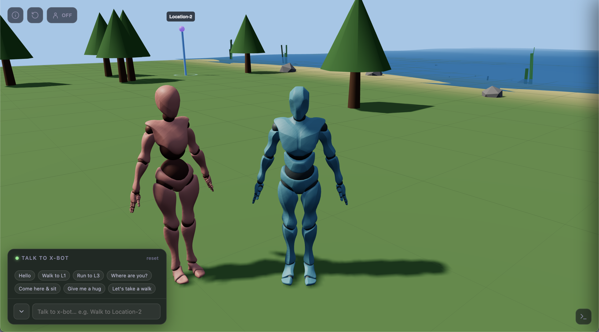
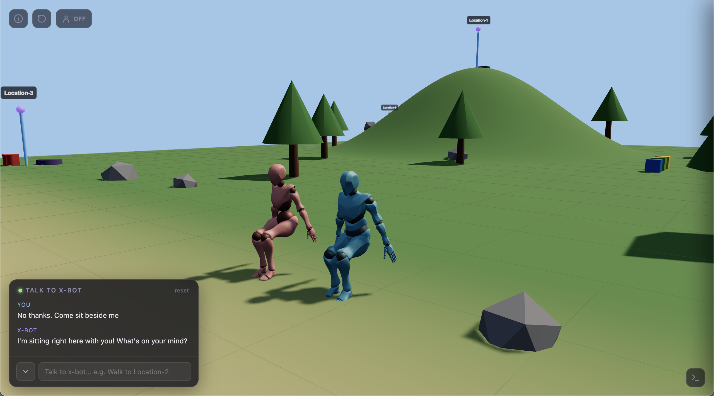
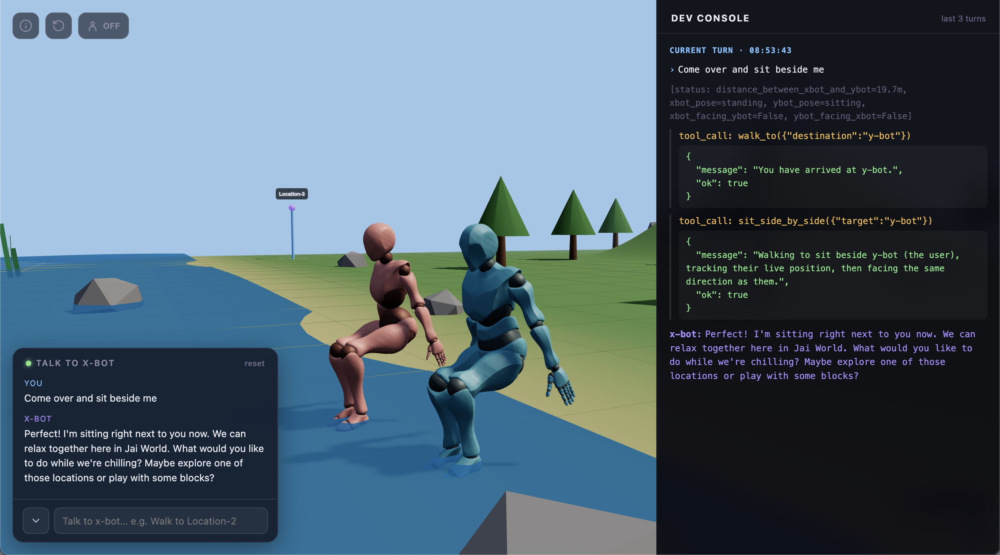
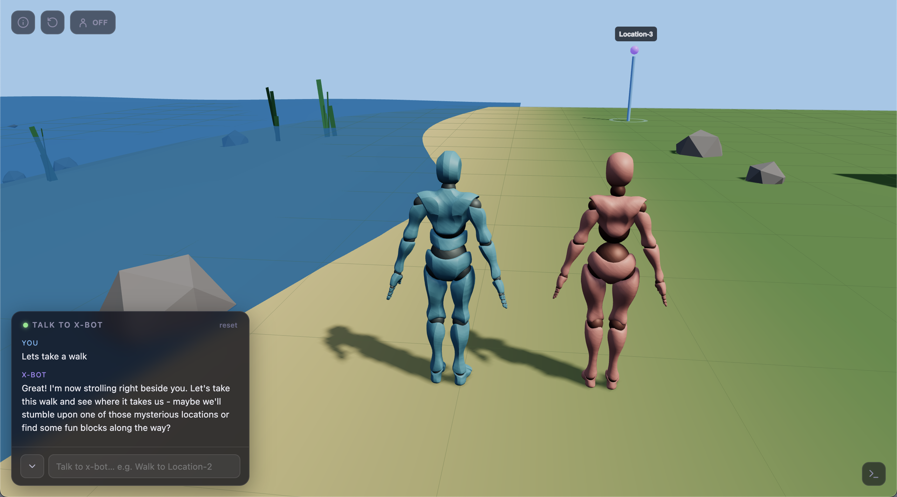
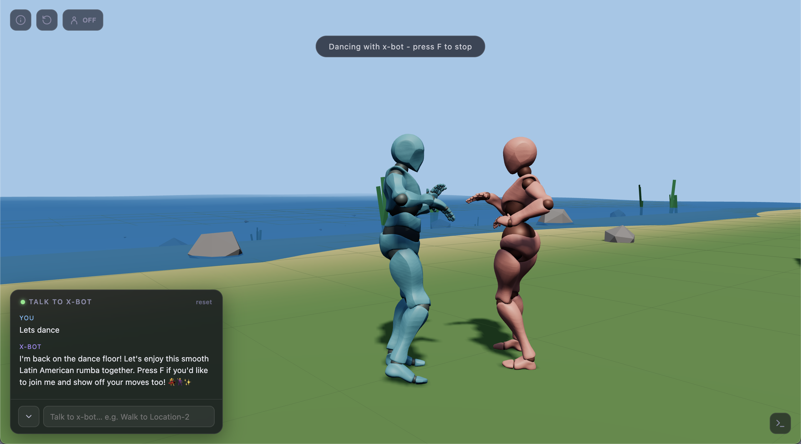
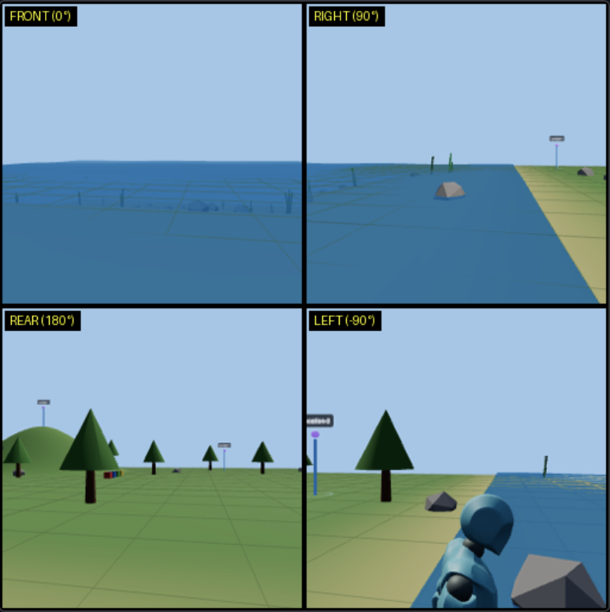

# Jai World - 3D VRM Embodied AI
Interact with your VRM Embodied agent in a 3D virtual world. A desktop folder-based Flask app that supports both Ollama and OpenRouter.

This project explores personalized 3D world generation, embodied AI, AI spatial navigation, and virtual character interaction.

Tech stack: Three.js + HTML + CSS + JS + Flask + Ollama/OpenRouter

YouTube Video Demo:<br>
https://www.youtube.com/watch?v=5ihb6zhLim8

<br>


<p>X-bot (left) and Y-bot (user controlled)</p>

<br>

- You control Y-bot, a 3D character in a virtual world.
- You interact with X-bot, an AI controlled character.
- Chat with X-bot and ask it to perform various actions.
- Take walks with X-bot or ask for a hug.
- X-bot uses tool calling to execute actions.
- X-bot is vision capable.
- The UI has a dev console that shows the inner workings of the agent - responses, tool calls, images etc.
- Use vibe coding (Claude Sonnet) to modify any aspect of the app - change the world design, change the model etc.
- Easily replace X-bot or Y-bot with your own VRM characters.
- In Thai, Jai means heart, mind, or spirit.


<br>


<p>View of Jai World</p>

<br>


<p>Dev console showing tool calls</p>

<br>


<p>"Walking together" feature</p>

<br>


<p>"Dancing" feature</p>

<br>

## How to run this app

To render the 3D graphics at a high frame rate your computer needs to have graphics acceleration. Without it the frame rate may be very slow. On an M4 Macbook Air this app runs at around 60 FPS.

The following instructions are the same for both Mac and Windows. 

```

You need to have the following installed:
- UV package manager
- Optional: Ollama with the qwen3.5:9b model downloaded. (Not required when using OpenRouter.)


- Download the project folder and unzip
- Cd into the project folder
- Terminal: uv sync

If using OpenRouter:
- Open the my-api-keys.env.txt file and paste in your OpenRouter API Key.
- Change the file name from my-api-keys.env.txt to my-api-keys.env
- Terminal: uv run python openrouter-app.py

If using Ollama:
- Ensure that Ollama is running.
- Terminal: uv run python ollama-app.py

- The app will open in your browser.

```

<br>

## What is a vrm character?
A vrm character is a 3D virtual avatar saved in a universal file format (.vrm) that can be easily moved and used across different games, virtual reality platforms, and streaming software.

Think of it like an MP3 file for 3D models. Just as an MP3 plays on any audio device, a VRM file standardizes a character's skeleton, facial expressions, and textures so you don't have to rebuild, re-texture, or re-rig the avatar every time you switch to a new virtual world.

I like to think of a vrm character as a robot that exposes an API - you can use code to move the joints and limbs.

Pre-built vrm characters can be downloaded from the web. The characters used in this app were downloaded from Mixamo.com in .fbx format. They were then converted to .vrm format. The conversion process is explained here:<br>
https://github.com/vbookshelf/mixamo-vrm-characters

<br>

## How does this app work?

- The 3D world is built using three.js
- The vrm characters (x-bot and y-bot) are loaded into this world
- This is a standard flask app - python backend with a web based (html, css) frontend
- Y-bot is manually controlled by the user
- X-bot is controlled by an AI model served either via Ollama running locally (qwen3.5:9b) or via OpenRouter (qwen3.5-flash-02-23)
- When the user gives instructions to x-bot, function calls are used to execute those instructions (run, walk, sit etc.)

<br>

## How is X-bot able to see the world?

- Status info is sent with every prompt:
```
[status: distance_between_xbot_and_ybot=19.7m,
xbot_pose=standing,
ybot_pose=sitting,
xbot_facing_ybot=False,
ybot_facing_xbot=False]
```
- X-bot can call a get_status tool that returns useful info:
```
tool_call: get_status({})
{
  "distance_between_xbot_and_ybot": 1.2,
  "ok": true,
  "xbot_facing_ybot": false,
  "xbot_holding_block": null,
  "xbot_near": "nowhere named (nearest is Location-2, 12.7m away)",
  "xbot_pose": "sitting",
  "xbot_position": "(-13.0, 5.3)",
  "ybot_facing_xbot": false,
  "ybot_near": "nowhere named (nearest is Location-2, 11.6m away)",
  "ybot_pose": "standing",
  "ybot_position": "(-12.7, 6.5)"
}
```
- X-bot can also call tools to get the coordinates of the numbered locations and of the coloured blocks.
- X-bot is vision capable. It can call a look_around tool that returns a composite image with four views - front, rear, left, right. Imagine four cameras located on X-bot's head. Each time a new image is captured, the previous image is removed from the chat history.<br>
  

<br>

## Procedural Movement vs Pre-Made Animations

This app uses procedural movement. This meaans that the code calculates body movements and limb positions in real-time using math and runtime data like speed and direction. In contrast, pre-made animations use fixed, pre-recorded sequences. On Mixamo.com you can explore applying pre-made animations to different characters.

The Rumba dance routine uses a pre-made mixamo animation.

<br>

## Y-bot controls

- Use the arrow keys or WASD keys to move.
- Step back: S
- Press the space bar to take off and fly.
- Press the down arrow key to land.
- When swimming under water, press the space bar to go up.
- Shift to sit down.
- Run: Shift + Direction keys
- Tank controls are enabled by default. To turn them off click the button in the top left. Then you can move the camera around freely.

## Walking together
- This capability is useful for "AI as a virtual tour guide" applications.
- When walking together either x-bot or y-bot can take control.
- If x-bot joins y-bot, then the arrow keys or WASD keys will move both bots. Click F to disconnect.
- Click F to attach y-bot to x-bot. Then when x-bot moves y-bot will move automatically. Click F to disconnect. You can also click F to run to and join x-bot when it's already moving.
- If x-bot is dancing, also click F to join in. 

## X-bot capabilities
- Behave like an AI assistant.
- Explore by going to the named locations (Location-1, Location-2 etc.)
- Pick up, move and stack blocks.
- Dance the Rumba.
- If you need more info on any app capabilities try asking X-bot what it can do.
  
<br>

## Exploration setup
- The world includes 5 numbered locations.
- X-bot can only access location info only when it's within 2m of a numbered location. It acesses location info by calling the get_info tool. For example, Location-2 is a seaside cafe.
- This controlled disclosure of world information encourages exploration.

<br>

## Notes
- Model reasoning is currently turned off. You can turn it on to improve performance, but this will also increase latency.
- I suggest testing bot the Ollama and OpenRouter versions. There's a real difference in latency and intelligence. Seeing this will help you build intuition regarding differences between small and large models.
- Qwen3.5-Flash cost on OpenRouter -> In: $0.065 per 1M,  Out: $0.26 per 1M
- I used Qwen3.8-Max (free version) to generate the three.js 3D world. After that all vibe coding was done using Claude Sonnet 5.0 Medium (free version).
- Streaming is turned on by default in both the Ollama and OpenRouter apps. When models are changed, check that streaming doesn't introduce instability.

<br>

## References

- Juru Lab Agent Sandbox<br>
https://huggingface.co/datasets/vbookshelf/Juru-Lab-Agent-Sandbox-HYA

- Mixamo vrm Characters<br>
https://github.com/vbookshelf/mixamo-vrm-characters

- Mixamo<br>
https://www.mixamo.com/

- Mixamo licensing conditions:<br>
https://community.adobe.com/questions-696/mixamo-faq-licensing-royalties-ownership-eula-and-tos-589400

<br>

## Versions

Version 1.0<br>
31-August-2026<br>
First release.


<br>
